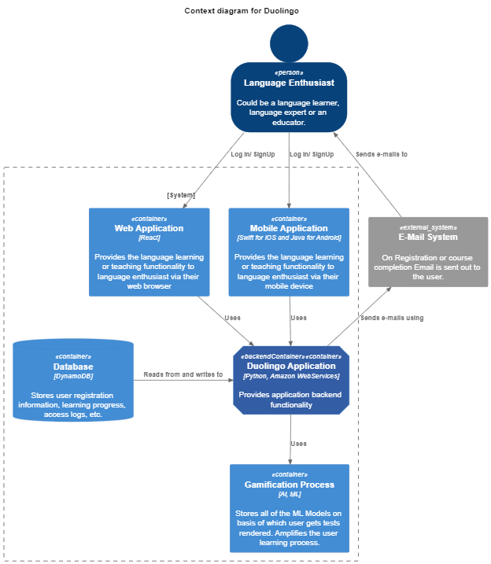

## ARCHITECTURE OF DUOLINGO

Duolingo is a popular language-learning platform that utilizes a specific architecture to help users learn new languages effectively. The architecture of Duolingo can be described as follows:

1. **Content Creation:** Duolingo employs a team of experts, including linguists and language specialists, who create the course content for each language offered on the platform. They develop a curriculum that covers various language skills, such as vocabulary, grammar, reading, writing, listening, and speaking.

2. **Skill Tree Structure:** Duolingo organizes its content into a skill tree structure. Users start at the beginner level and progress through a series of skills and lessons. Each skill focuses on a specific aspect of the language, and users must complete lessons within each skill to unlock the next one. This structured progression ensures a gradual and comprehensive learning experience.

3. **Gamification:** Duolingo incorporates gamification elements to make the learning process more engaging and motivating. Users earn points, experience levels, maintain streaks, and achieve certain milestones. These rewards and progress indicators encourage users to stay motivated and continue learning.

4. **Adaptive Learning:** The platform utilizes adaptive learning techniques to personalize the learning experience for each user. Duolingo tracks user performance and adjusts the difficulty of exercises and lessons based on individual strengths and weaknesses. This adaptive approach ensures that learners receive appropriate challenges and targeted practice in areas they need to improve.

5. **Bite-sized Lessons:** Duolingo employs a micro-learning approach by offering short, bite-sized lessons that can be completed in a few minutes. This allows users to fit language learning into their daily routines and promotes regular practice. The lessons are designed to be interactive and include exercises like translation, matching, listening comprehension, and speaking practice.

6. **Crowdsourced Translation:** Duolingo incorporates a unique feature called "Duolingo for Schools" that allows users to contribute to real-world translations while learning. Users can translate sentences or documents, which helps in language immersion and provides practical application of the language skills they are learning.

7. **Social Features:** Duolingo includes social features that enable users to connect with friends, compete in leaderboards, and share achievements. This social aspect adds a collaborative and competitive element to the learning process, fostering engagement and a sense of community among users.

### C4 MODEL OF ARCHITECTURE

C4 stands for **context**, **containers**, **components**, and **code** — a set of hierarchical diagrams used to describe our software architecture at different zoom levels, each valid for different audiences.

The C4 model considers the static structures of a software system in terms of containers (applications, data stores, microservices, etc.), components, and code. It also considers the people who use the software systems that we build.

####  System context diagram
Level 1, a system context diagram, shows the software system we have built and how it fits into the world in terms of the people who use it and the other software systems it interacts with. 

Here is an example of a system context diagram that describes how a language enthusiast uses the Duolingo app to learn or teach a new language.

####  Container diagram
Level 2, a container diagram, zooms into the software system and shows the containers (applications, data stores, microservices, etc.) that make up that software system. Technology decisions are also a key part of this diagram.

It shows that Duolingo comprises five containers: a server-side web application, a mobile app, a server-side API application, ML models, and a database.

1. **Learner persona**
* **Name**: Lewis 
* **Age**: 22
* **Occupation**: College student
* **Background**: Lewis is a college student who wants to improve his language skills to enhance his job prospects. He is interested in learning German and uses Duolingo regularly to practice his language skills. He prefers the app because it is convenient and flexible, allowing him to learn at his own pace.
  

2. **Educator persona**
* **Name**: Lilith 
* **Age**: 22
* **Occupation**: School Teacher
* **Background**: Lilith is a school teacher who wants to use the app as a teaching platform for her students. She believes that learning can be hybrid in the way that she teaches her students Italian in school and they can practice their lesson of the day on Duolingo for School. This enables students to practice in a fun and exciting way. It makes it easier to grade her students from the platform as well.

